The 2x2 Matrix is something that consultancy company BCG is apparently known for. In my experience with them, they certainly did trot out a 2x2 matrix, but it wasn't *exactly* like this. It breaks up into 4 quadrants along to dimensions: growth and share.

## Definitions
**Share** refers to the amount of the overall market *your product holds*.
**Growth** refers to the amount that the overall market is expanding.

```mermaid
quadrantChart
    title Growth & Share
    x-axis Low Growth --> High Growth
    y-axis Low Share --> High Share
    quadrant-1 "⭐️ Stars"
    quadrant-2 "🐮 Cash Cow"
    quadrant-3 "🐶 Pets"
    quadrant-4 "❓ Question Marks"
```

The idea is that you plot out the different value-generating endeavors of your business across these two axes, and you can determine where to focus (or not) your resources.

Helpfully [[Mermaid]] now supports Quadrant Charts!

****
### Source
- [BCG](https://www.bcg.com/about/overview/our-history/growth-share-matrix)

### Related
- [[Mermaid]]