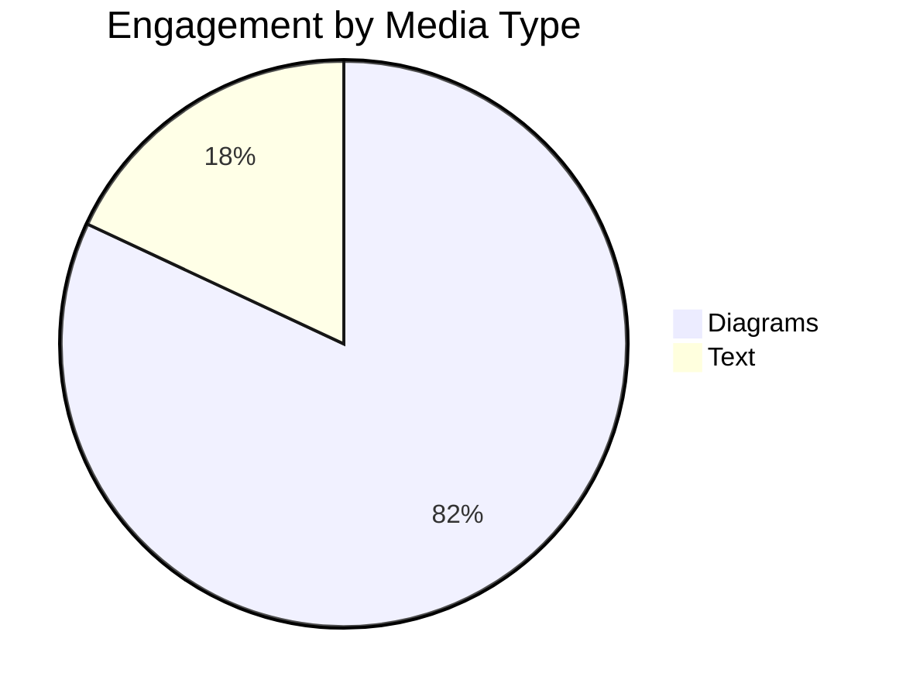

A picture is worth 1000 words. So if you can create a picture using a few lines of code you have turned a few lines of code into 1000 words.

# What

“Diagrams as Code” is exactly what it sounds like: illustrated diagrams that are created using code.

Most diagrams you can draw using code fall under the umbrella of UML, the Unified Modeling Language. UML was designed to support software development, and software developers are the ones to write code. Thus UML Diagrams as code was a natural fit.

## The Main Contenders

Like most good ideas, there are a two main competing standards:

- PlantUML - Java, 2009 (uses “GraphViz”, which also supports many other, lesser used platforms)
- Mermaid - JavaScript, development started in 2014 - but most really picked up around mid-2019

## Diagram types

|Graph Type|Depiction Description|PlantUML|Mermaid|
|---|---|---|---|
|Class Diagram|The types of things that can exist, how they relate, their properties, and what they can do. From UML.|✅|✅|
|State Diagram|The different ways in which a thing can exist, and how it transitions in between those ways. From UML.|✅|✅|
|Entity-Relationship Diagram|The types of types of things that can exist, their properties, and how their properties relate. NOT from UML, but used in lots of contexts.|✅|✅|
|Flowchart|Generic flowchart. Labeled boxes of different shapes with different kinds of labeled arrows between them.|✅|✅|
|Gantt|A timeline across the X-axis, with events stacked along the Y-axis positioned to fit where they take place in time. A common business/project management tool.|✅|✅|
|Pie Chart|Chart made of pie… Wait no.||✅|
|Bar Chart|Brand new (as of this writing) capability that is in beta. It's... okay. ||✅ |
|Requirement Diagram|A view of Requirements of a system. How they relate to one another and to parts of the system. From SysML.||✅|
|Sequence Diagram|A specialized view showing how messages are exchanged between participants. Has a timeline about the Y axis, and multiple vertical bars distributed about the X axis representing the participants. Messages go between the participants going down the page. From UML.|✅|✅|
|Timing Diagram|A basic depiction of the behavior or state of an entity over time. Timeline about the X axis. The Y axis often has different modes of operation in which the subject exists over time. From UML.|✅||
|Use Case Diagram|The users of a system, and the part or features of the system that they care about. From UML.|✅||
|Activity Diagram|A specialized flow chart utilizing UML syntax. Doesn’t really do anything a regular flow chart can’t do, but includes some confusing syntax. ATTACK OUTTA NOWHERE GET LOST ACTIVITY DIAGRAMS.|✅||
|JSON View|An Entity-Relationship diagram built using a JSON file, to depict the structure of they keys of that JSON file.|✅||

That table is **not** exhaustive. Both platforms offer additional diagram types, in particular PlantUML which offers several. I just don’t care about whatever a ‘Ditaa diagram’ is.

# Why

So, the concept is easy enough to comprehend; but what may be less clear is _why_ you’d want to use code to produce diagrams in the first place. There are several great reasons, including one that you may not believe[^1].

## Diagrams are Necessary

Most of us can grasp pictures faster than we can read. Images are a shortcut to understanding. The allow us to process with both the deep thinking and the visiospatial reasoning pars of our brains. You can use dual channels to process, and therefore get from where you are to understanding _faster_.

Diagrams are also more engaging than simple text. You probably saw that below before you read it up here.



## It’s Faster to Code than it is to Draw

With even a modest amount of learning and practice, it is possible to produce well-formed, neatly drawn graphs and diagrams using a keyboard FASTER than you’d be able to do on a whiteboard. Moreover, you can make great, sweeping changes to a diagram, fundamentally changing the position of all its elements in some cases just by changing a single character, whereas on a whiteboard you’re erasing and re-drawing.

Of course there are always going to be certain things that are infinitely easier to do with a pen and paper than with a keyboard. If your diagram doesn’t fall neatly into one of the categories for which there exist code-based diagramming solutions, well then you’re going to need to bust out a pen and paper.

## Versioning

When your diagrams are produced dynamically based on some declarative code, you have access to all of the same tools that you use to manage the _rest_ of your code. You can commit and push changes to GitHub, or your favorite version control system. You can quickly jump around to different versions of different diagrams.

## Storage & Transmission

Text takes up less space than .PNGs. Text-based diagrams can also be deconstructed and transmitted via any medium that only allows for text transmission. You could feasibly send a diagram over Morse Code[^2]. Even text-based image storage formats like SVG are probably longer than the code it takes to produce them.

## Colocation

This is the **real** reason diagrams as code has ever received any attention. The real ace in the hole. They can just live alongside - or even _inside_ - the code they represent. There’s nothing more convenient than using the tool you’re already using to produce a wholly new variety of helpful thing.

# How

Okay, so we know what they are, and maybe we’re sold on _why_ we want them… but how do we get them?

## Deployment

Both PlantUML and Mermaid offer online diagram generators. Currently Mermaid’s is by far and away better than PlantUMLs by any metric.

[Online FlowChart & Diagrams Editor - Mermaid Live Editor](https://mermaid.live/)

[PlantUML Web Server](https://www.plantuml.com/plantuml/uml)

A major difference between the two platforms is that PlantUML expects to be installed _locally_ and used to create diagrams that are saved _locally_, whereas Mermaid expects you’ll be using it in the browser to render graphs to a webpage.

Installing **PlantUML** involves downloading & installing:

1. Java
2. Graphviz (which handles layouts)
3. PlantUML

Interestingly it looks like PlantUML is _also_ available [via NPM](https://www.npmjs.com/package/plantuml) - it’s just not officially supported.

**Mermaid’s** intended application is via inclusion as a script tag using a CDN, or through local install using NPM… both of which are much easier. You could simply copy/paste the below into a text file on your computer, save it with a ‘.html’ suffix, then open it in your browser to see your diagram.

```
<html>
  <script src="<https://cdn.jsdelivr.net/npm/mermaid/dist/mermaid.min.js>"></script>
  <body>
    Here is a mermaid diagram:
    <div class="mermaid">
      graph TD
        A[Client] --> B[Load Balancer]
        B --> C[Server01]
        B --> D[Server02]
    </div>
    <script>
      mermaid.initialize({ startOnLoad: true });
    </script>
  </body>
</html>
```

Both Mermaid and PlantUML enjoy wide application support. You can utilize them to create diagrams with minimal configuration (and sometimes _no configuration_) in the following environments[^3] :

|Platform|PlantUML|Mermaid|
|---|---|---|
|Notion||✅ - Native Support|
|Open Office|✅||
|Confluence|✅|✅|
|GitLab|✅|✅ - Native Support|
|GitHub||GitHub pledged native support “soon”|
|GitBucket|✅||
|VS Code|✅|✅|
|Atom|✅|✅|
|Eclipse|✅||
|IntelliJ IDEA|✅||
|VIM|✅|✅|
|Sphinx|✅|✅|
|TypeDoc|✅|✅|
|…many more|||

PlantUML is more widely supported, but Mermaid is quickly catching up and has some high-profile applications with native support. See [Mermaid’s list](https://mermaid-js.github.io/mermaid/#/./integrations) and [PlantUMLs list](https://plantuml.com/running).

## Comparing Inputs vs Outputs

Syntactically they aren’t that different, but when they do differ, PlantUML is more _descriptive_ whereas Mermaid is more graphically _representative_. In terms of output, Mermaid diagrams tend to be “prettier” to my eye, but PlantUML tends to produce clearer diagrams with more contrast.

Here are a few of my favorite diagram types, depicting of bite-sized examples of the input syntax and output graphics for your consideration. These were created using the online tools found on each of their respective home pages ([Mermaid.live](https://mermaid.live/) and [http://www.plantuml.com/plantuml/uml](http://www.plantuml.com/plantuml/uml)).

These diagram depict different aspects of my Personal Data Warehouse (PDW) project.

### Class Diagram

The next iteration of the PDW I’m working on right now uses [an NPM package I authored](https://www.npmjs.com/package/wrapper-lib). This describes that package. The PDW Class Diagram itself is too big to use as a ‘_bite sized example_’.

```
classDiagram
class HTMLElement
class Wrapper{
  +HTMLElement element
  +[Observer|Wrapper] subscribers
  text(string)
  value(string|number|boolean)
  style(string)
  data(string, string)
  newWrap()
  onEvent(string, function)
  bindTo(Observable)
  handleChange(string|number|boolean)
  addSubscriber(Observer)
  notifySubscribers(string|number|boolean)
}
Wrapper "1" *-- "1" HTMLElement : Wraps v
class Observable{
  -value
  +subscribers
  +getVal()
  +setVal()
  +addSubscriber(Observer)
  -notifySubscribers(string|number|boolean)
}
class WrappedInputLabelPair{
  +container: HTMLDivElement
  +label: Wrapper
  +input: Wrapper
}
WrappedInputLabelPair --|> Wrapper : Extends
class Observer{
  handleChange(string|number|boolean)
}
Wrapper -- Observable : < Bindable To
Observer -- Observable : Bindable To v
Observer -- Wrapper : Bindable To >
```

Mermaid code ⬆️ yields Mermaid diagram ⬇️


```
@startuml
class HTMLElement
class Wrapper{
  +HTMLElement element
  +[Observer|Wrapper] subscribers
  --Getters and Setters--
  text(string)
  value(string|number|boolean)
  style(string)
  data(string, string)
  --Utilities--
  newWrap()
  onEvent(string, function)
  bindTo(Observable)
  handleChange(string|number|boolean)
  addSubscriber(Observer)
  notifySubscribers(string|number|boolean)
}
Wrapper "1" *-- "1" HTMLElement : Wraps >
class Observable{
  -value
  +subscribers
  +getVal()
  +setVal()
  +addSubscriber(Observer)
  -notifySubscribers(string|number|boolean)
}
class WrappedInputLabelPair{
  +container: HTMLDivElement
  +label: Wrapper
  +input: Wrapper
}
WrappedInputLabelPair --|> Wrapper : Extends
class Observer{
  handleChange(string|number|boolean)
}
Wrapper -- Observable : Bindable To >
Observer -- Observable : Bindable To >
Observer -- Wrapper : Bindable To >
@enduml
```

PlantUML code ⬆️ yields PlantUML diagram ⬇️


### Sequence Diagram

How the PDW operates when I send it queries. Interestingly, both diagrams were made using literally the exact same text.

```
sequenceDiagram
    autonumber 
    participant dbHost
    participant apiHost
    actor client
    Note over client: Search for Entries
    client-->>apiHost: query string
    apiHost-->apiHost: parse request 
    alt is invalid
    apiHost-->client: bad query
    else is valid
    apiHost-->>dbHost: translated query
    dbHost-->dbHost: fetch results
    dbHost-->>apiHost: raw data
    apiHost-->apiHost: perform shaping
    apiHost-->>client: results
    end
```

Mermaid code ⬆️ yields Mermaid diagram ⬇️


```
@startuml
    autonumber 
    participant dbHost
    participant apiHost
    actor client
    Note over client: Search for Entries
    client-->>apiHost: query string
    apiHost-->apiHost: parse request 
    alt is invalid
    apiHost-->client: bad query
    else is valid
    apiHost-->>dbHost: translated query
    dbHost-->dbHost: fetch results
    dbHost-->>apiHost: raw data
    apiHost-->apiHost: perform shaping
    apiHost-->>client: results
    end
@enduml
```

PlantUML code ⬆️ yields PlantUML diagram ⬇️


### Flow Chart/Activity Chart

This flow chart describes the overall trajectory of the PDW Project. Flowcharts are where the syntax and what’s possible gets **very**different between the two platforms

```
graph TD
a(Spreadsheets)
b(Spreadsheets & Webapp with JavaScript)
subgraph "Where I've been for 1.5 Years"
c(MongoDB & Glitch with JavaScript)
end
d(Firestore & Firebase with TypeScript)
e(Firestore & Firebase with TypeScript & various frameworks)
f(SQL & Python)
g(iPhone/iPad)
a-->b-->c-->d-->e-->f-->g
style c fill:#bbf
```

Mermaid code ⬆️ yields Mermaid diagram ⬇️


```
@startuml
:Spreadsheets;
:Spreadsheets & Webapp with JavaScript;
#lightblue:MongoDB & Glitch with JavaScript;
floating note left: Where I've been for 1.5 years
:Firestore & Firebase with **TypeScript**;
:Firestore & Firebase with **TypeScript** & various frameworks;
:SQL & Python;
:iPhone/iPad;
@enduml
```

PlantUML code ⬆️ yields PlantUML diagram ⬇️


# How to Choose Between PlantUML and Mermaid

Coke or Pepsi. McDonald’s or Burger King. Apple or Google. Team Edward or Team Jacob.

How do you choose?

### Specific diagram type or feature coverage

PlantUML covers more of the UML Core Diagrams. Mermaid offers Requirement diagrams (from SysML). If you absolutely **need** to make Activity Diagrams, PlantUML is your only choice.

Mermaid takes a more **lean** approach when it comes to adding features. On the whole, PlantUML offers features (e.g. native “Notes” on diagrams, like the note on the last diagram above).

### Ease-of-implementation in your environment

Depending on _where_ you want to use your diagrams, you shouldn’t fight what’s easiest. Check out the compatibility table here (which I probably won’t maintain over time).

### Syntactic Preferences

One diagramming method may be your preferred syntax. Sequence diagrams are (or at least _can be_) the same syntax for both, but they take very different approaches for things like simple flowcharts. Mermaid’s syntax feels less daunting to me. Mermaid code blocks are practically readable by themselves. PlantUML is a bit less intuitive, from my perspective.

### Stylistic Preferences

Lastly, you might just prefer one the look of platform’s diagrams over the other. Going into this article I heavily favored Mermaid. Now I’m firmly on the fence. PlantUML diagrams are less “aesthetic”, but perhaps this makes them more _readable_. The bolder, higher contrast default for PlantUML looks a bit clunkier, but also easier to parse.

Some use cases I like Mermaid, some I like PlantUML…

…What we need is [a third diagramming platform that covers both their use cases](https://xkcd.com/927)!

# Post Script: SysML 2.0

Just so I can point to this at some time in the future and say “see, I was right”, I think that SysML 2.0 has the potential to completely upend this whole domain. Unlike any v1.x version of SysML, SysML 2.0 will have a graphical AND textual language. And you’ll be able to transition between them in both directions. That means SysML will be **both** _diagrams as code_, **and** _code as diagrams_… **and** that the diagrams will be interconnected as part of an underlying model representing a cohesive whole. The elements within your sequence diagrams are semantically linked to the classes in your class diagram. And you’ll be able to transition from either of those diagrams into the State Machine diagram that defines how instances of those things may exist. I imagine, also, that you’ll be able to natively execute system simulations using the model. It will an absolute beast compared to either of the platforms I focused on in this article.

[^1]: Accidental Buzzfeed Article Title
    
[^2]: Your argument is only as good as your weakest point. I reckon this was the bottlenecking factor for this whole article. 
    
[^3]: This table is DEFINITELY partial, and probably wrong in parts… a real, legitimate list would take this entire article to include. Also it won’t be maintained going forward. The point is to illustrate they are both pretty widely supported.