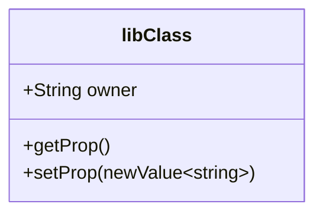

**One of the main building blocks of UML - shows attributes and methods of classes, as well as relationships between classes.**

Class Diagrams are primarily a ***structural*** diagram in UML. It’s probably one of the more widely-used UML diagram types. They show inheritance patterns between classes, and the properties they carry - but also include *some* behavioral elements as they may also include Class methods.

Class diagram nodes have a compartment for the name, then properties of the class, then its methods.



They include syntax for property/method visibility:

```
+	Public
-	Private
#	Protected
~	Package
```

And the arrows linking classes also carry semantic meaning:


For more: see ‣ 

They are akin to Block Definition Diagrams in [[SysML]].

---

### Source

[Class diagram - Wikipedia](https://en.wikipedia.org/wiki/Class_diagram)

Also just using them in [[Mermaid]] 

### Related
- [[UML]] 
- [[Mermaid]]