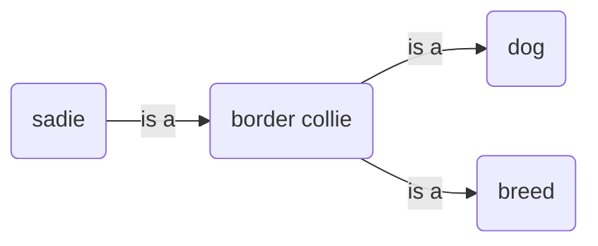

---
tags:
- modeling
---
**One is transitive, one is not.**

If you’re being pedantic, there is a distinction between “Classification” type relationships and “Generalization” type relationships. They are heavily overlapping terms. Both kinds of relationships can be described with the phrase ‘is a’. But the difference (if one is enforced) comes down to whether or not the relationship is a [[Transitive Relationship]]**.**

Classifications are not transitive. 
Generalizations are transitive.

Consider this ‘is a’ chain:

1. Sadie is a Collie. 
2. Collie is a dog. 
3. Collie is a breed..

You can combine 1 and 2, skipping the middle entity to say “Sadie is an dog”, because they are **generalizations**, and thus transitive.

You cannot combine 1 and 3, skipping the middle entity to say “Sadie is a breed”, because the relationship between ' Border Collie’ and ‘breed’ is a **classification**.

# Source

[Classification and Generalization](https://etutorials.org/Programming/UML/Chapter+6.+Class+Diagrams+Advanced+Concepts/Classification+and+Generalization/)

### Related Notes
- [[Entity Relationship Categories]] 
- [[Transitive Relationship]]