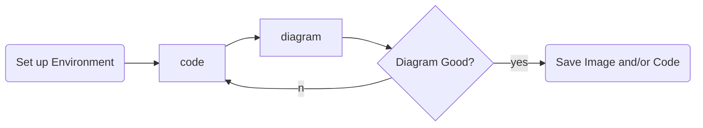

**Draw diagrams with your keyboard.**

# What and Why

“Diagrams as Code” is exactly what it sounds like: illustrated diagrams that are created using code.

## It’s Faster to Code than it is to Draw

With even a modest amount of learning and practice, it is possible to produce well-formed, neatly drawn graphs and diagrams using a keyboard FASTER than you'd be able to do on a whiteboard. Moreover, you can make great, sweeping changes to a diagram, fundamentally changing the position of all its elements in some cases just by changing a single character, whereas on a whiteboard you’re erasing and re-drawing.

Also, honestly, when I’m thinking about how things should work, I think about “A” connects to “B”. Having A and B represented as boxes on a whiteboard is actually *distracting*. You’re not thinking about “A” the **thing**, you’re thinking about “A” the sort-of-rectangular blob you drew & wrote a word in. I find it easier to simply write out a list of connections and let the diagram draw those connections for you.

Of course there are always going to be certain things that are infinitely easier to do with a pen and paper than with a keyboard. If your diagram doesn’t fall neatly into one of the categories for which there exist code-based diagramming solutions, well then you’re going to need to bust out a pen and paper.

## Versioning

When your diagrams are produced dynamically based on some declarative code, you have access to all of the same tools that you use to manage the *rest* of your code. You can commit and push changes to GitHub, or your favorite version control system. You can quickly jump around to different versions of different diagrams.

## Storage & Transmission

Text takes up less space than .PNGs. Text-based diagrams can also be deconstructed and transmitted via any medium that only allows for text transmission. You could feasibly send a diagram over Morse Code[^2]. Even text-based image storage formats like SVG are probably longer than the code it takes to produce them. 

## Colocation

This is the **real** reason this The real ace in the hole for diagrams as code.. they can just live alongside - or even *inside* - the code they represent. There's nothing more convenient than using the tool you're already using to produce a wholly new variety of helpful thing.

---
### Source

[Quick Start Guide](https://plantuml.com/starting)

[mermaid - Markdownish syntax for generating flowcharts, sequence diagrams, class diagrams, gantt charts and git graphs.](https://mermaid-js.github.io/mermaid/#/n00b-gettingStarted)

### Related
- [[PlantUML]] 
- [[Mermaid]] 
- [[PlantUML vs Mermaid]]