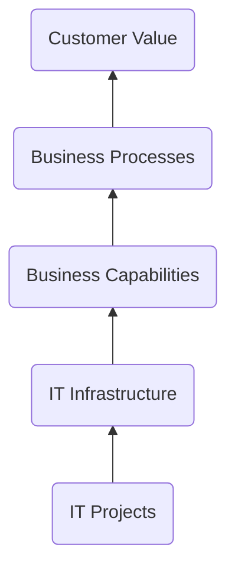

[[Enterprise Architecture as a Strategy]] defines `enterprise architecture` as:

Enterprise architecture is the logic that organizes IT Infrastructure around Business Processes, reflecting the [[Company Operating Model]] (set points for *integration* and *standardization*). Architecture aligns IT project capability deliveries to long-term company process, systems, and technology needs. It allows a company to [[Build On Yourself]], rather than create ad-hoc solutions, starting from scratch each time.

Architectural *modeling* using [[Enterprise Architecture Frameworks]] is the practice of representing these. The book from the source suggests a more humble approach using simple [[Core EA Diagrams]]. 

---
### Source
- [[Enterprise Architecture as a Strategy]]

### Related
- [[Company Operating Model]]
- [[Archimate]]
- [[UAF]]