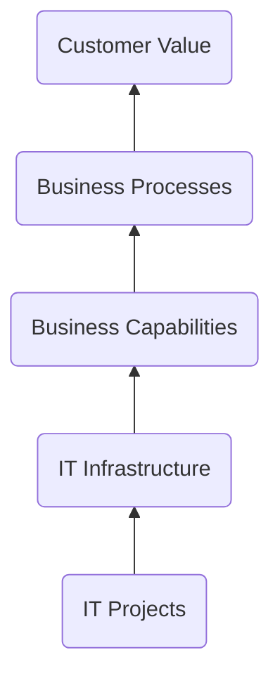

[[Enterprise Architecture as a Strategy]] defines `enterprise architecture` as:

Enterprise architecture is the logic that organizes IT Infrastructure around Business Processes, reflecting the [[Company Operating Model]] (set points for *integration* and *standardization*). Architecture aligns IT project capability deliveries to long-term company process, systems, and technology needs. It allows a company to [[Build On Yourself]], rather than create ad-hoc solutions, starting from scratch each time.

Architectural *modeling* using [[Enterprise Architecture Frameworks]] is the practice of representing these. The book from the source suggests a more humble approach using simple [[Core EA Diagrams]]. 

While there is no one “correct” way to present or think about EA, there is one that deems to be the most common:
![[IMG_1664.png]]

The business architecture is the least complex. It’s held up by the business information (or data), which is slightly bigger. That’s held up by applications, which are in turn held up by underlaying technologies. For more, see: [[Enterprise Architectural Layers]].

---
### Source
- [[Enterprise Architecture as a Strategy]]
- [Image](https://www.linkedin.com/pulse/enterprise-architecture-domains-pillars-getz-pmp-csm-aws-cmmi)

### Related
- [[Company Operating Model]]
- [[Archimate]]
- [[UAF]]