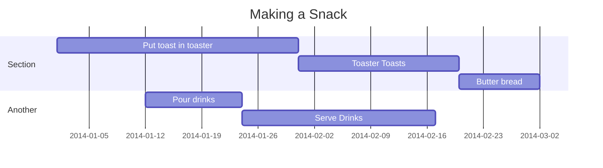

**Scheduling diagrams with dependent events shown as cascading rectangles on a linear schedule.**

Gantt Charts are a form of scheduling diagram in which activities are represented in rectangles, placed along a common timeline, often including relationship constraints like “finish/begin” constraints. Common tools for creating Gantt charts include things like Microsoft Project - or even Notion’s Timeline database view. But you can also draw them with [[Diagrams as Code]] tools.

## Examples

### Mermaid

### PlantUML

---

### Source

### Related
- [[Mermaid]] 
- [[PlantUML]]