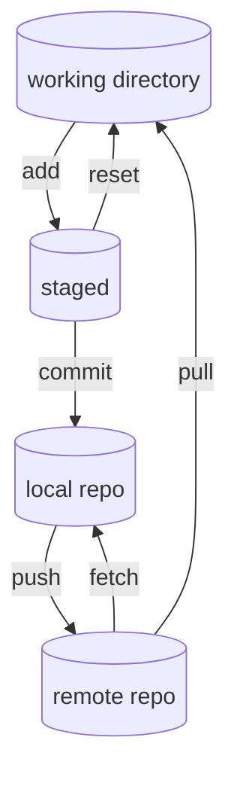

**The standard tool for Version Control of computer files**

## Terminology Cheat Sheet

#### Basic movement
Push, pull, fetch, commit, add, & reset



#### Branch management
Branch, checkout, merge
- `git branch` - creates a new branch
- `git checkout ` - switches between branches in the local repo
- `git merge` - pull changes from one branch to another
	- fast-forward merge - is a merge from a branch back to main WHEN the main hasn't been changed from the point the branch was made. Probably most of my merges.

**fast-forward merge**:
```terminal
# Start a new feature
git checkout -b new-feature main 
# Edit some files
git add <file>
git commit -m "Start a feature"
# Edit some files
git add <file> git commit -m "Finish a feature"
# Merge in the new-feature branch 
git checkout main
git merge new-feature
git branch -d new-feature
```

---
### Source
- using it, and...
- [Atlassian's guide](https://www.atlassian.com/git/tutorials/using-branches)

### Related
- [[SemVer Versioning]]
- [[Gods of CS]]
 