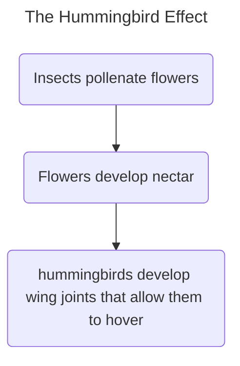

---
# alias:
---
**Unexpected but direct impacts of developments in one area on an entirely different area**

Steve Johnson coins the term “Hummingbird Effects” to describe when a change or innovation in one area unexpectedly but directly generates a change or innovation in an entirely different area. The term refers to the co-evolution of flowers and insects that created the long stems holding rich nutrients. This change begat a change not found elsewhere in the avian world - the hummingbird’s ability to hover. It creates down-force with both the forward and backward stroke of its wings so that it can hover at a flower and access the nectar. Insects pollinating plants causes plants to become better at attracting insects, which causes evolutionary pressure for hummingbirds to develop the ability to hover in place.

---
### Source
- [[How We Got to Now]]

### Related
- [[2nd Order Effects]]

#### Tags
#philosophy #science 

