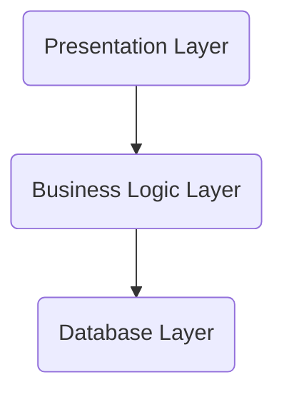

**When components of a system are separated out into discrete layers**

Each layer might be made up of several sub-components, but spans the entirety of that responsibility. Each layer typically only interacts with the layer directly above it and the layer directly below it. This isolates changes in one layer from propagating/affecting multiple other layers. It provides for better [[Separation of Concerns]].

The [[MVC Pattern]] is an example of a Layered Architecture.

From a wider perspective, see: [[Enterprise Architectural Layers]].

---
### Source
- 

### Related
- [[How to Take Smart Notes Thesis]]
- [[Highly Cohesive, Loosely Coupled]]
- [[MVC Pattern]]
 