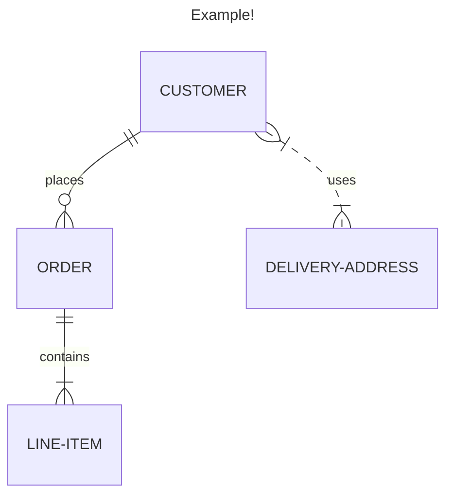

**A Markdown-inspired text language for encoding graphs and charts.**

"Mermaid" is the name of a [[JavaScript]] tool that translates text into Charts and graphs. It handles things like:

- Flow Charts
- Entity Relation Diagrams
- Sequence Diagrams
- Class Diagrams
- Gantt Charts
- Pie Charts
- ... and now 2D Graphs!

It is a newer, brighter-burning cousin to [[PlantUML]]. Mermaid has native support in GitLab, [[Notion]], [[Obsidian]], and soon GitHub (among other places).

There is an excellent free Progressive Web App for creating, learning about, and sharing Mermaid diagrams:
[Online FlowChart & Diagrams Editor - Mermaid Live Editor](https://mermaid.live)

## Example

---

### Source
- https://mermaid.js.org

### Related
- [[Markdown]] 
- [[Plain Text Durability]] 
- [[PlantUML]] 
- [[PlantUML vs Mermaid]]