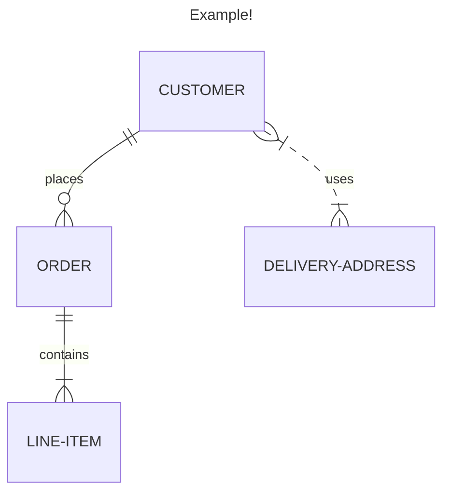
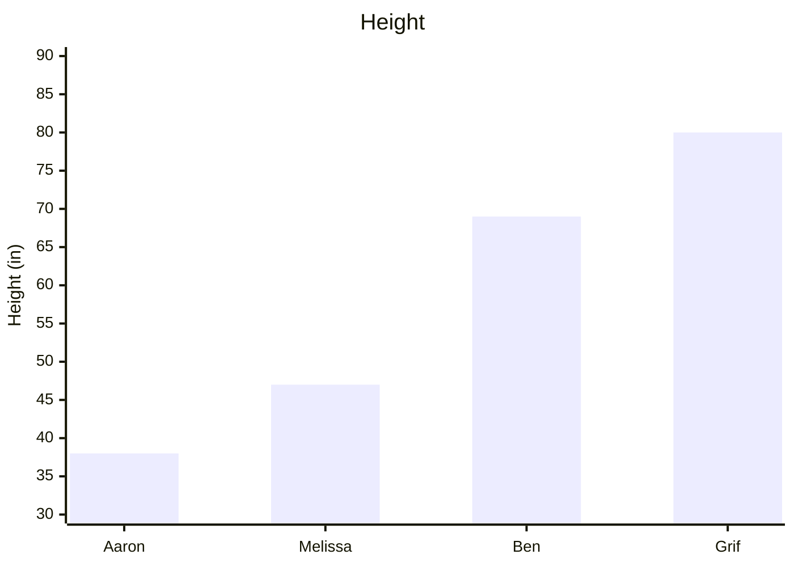

**A [[Markdown]]-inspired text language for encoding graphs and charts.**

"Mermaid" is the name of a [[JavaScript]] tool that translates text into Charts and graphs. It handles things like:

- [[Flow Charts]]
- [[Entity-Relationship Diagrams]]
- [[Sequence Diagrams]]
- [[Class Diagrams]]
- [[Gantt Charts]]
- Pie Charts
- ... and now 2D Graphs!

It is a newer, brighter-burning cousin to [[PlantUML]]. Mermaid has native support in GitLab, [[Notion]], [[Obsidian]], and soon GitHub (among other places).

There is an excellent free Progressive Web App for creating, learning about, and sharing Mermaid diagrams:
[Online FlowChart & Diagrams Editor - Mermaid Live Editor](https://mermaid.live)

Since I originally wrote this note Mermaid introduced many new great features:
- [[Frontmatter]] support for titles & config info
- New syntactic sugar, like A & B --> C for creating two links on the same line
- Lollipop connectors & bi-directional arrows 
- New chart types
## Examples

### Check Deployed Version
```mermaid
info
```

### ER Diagram

### XYChart
...not yet supported in Obsidian.


---

### Source
- https://mermaid.js.org

### Related
- [[Markdown]] 
- [[Plain Text Durability]] 
- [[PlantUML]] 
- [[PlantUML vs Mermaid]]