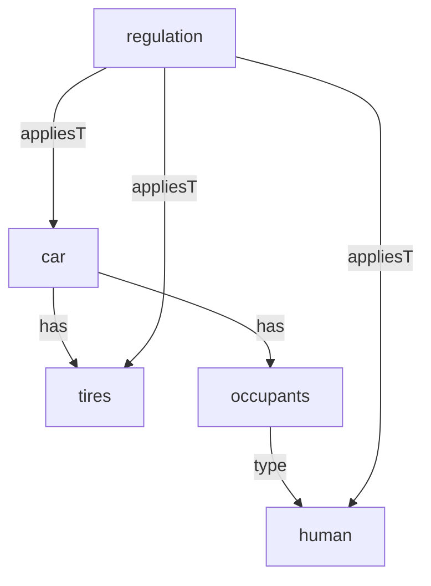

**A container for text string meanings, providing context and preventing ambiguity.**

“Namespace” is a concept popular in coding that refers to a boundary in which text strings are contextualized. A well-defined Namespace removes ambiguity from string literals, making the entities to which they refer clear. Namespacing is a key concept in both coding and [[MBSE]]. They are explicitly called out as a good idea in [[The Zen of Python]].

In short, namespaces are what separates “modeling”:


From “modeling”:


From “modeling”:



It’s a very abstract concept, so here are some other examples.

### General example

```
text: "Carl"
reference: ambiguous at this point.

text: "Carl"
Namespace: "Jim Carrey characters"
reference: The character Jim Carrey plays in the movie "Yes Man"

text: "Carl"
Namespace: "Famous Scientists"
reference: Carl Sagan
```

### Coding example

```jsx
let x = 'hello';
class myClass{
	private x;
	constructor(xIn){
		this.x = xIn;
	}
}
let classInstance = new myClass('goodbye');

console.log(x); // prints 'hello', refers to x the script's global namespace
console.log(classInstance.x); // prints 'goodbye', refers to x in the myClass namespace
```

****
### Source

### Related
- [[URI]] 
- [[JSON-LD]] - the links utilize a given namespace
- [[The Zen of Python]]