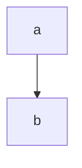

**How Notion [[Notion]] flavors its Extended Markdown Syntax [[Extended Markdown Syntax]] **

This note is an **experiment** to see how [[Notion]] handles [[Markdown]].

# Fully supported in Markdown:

---

# Headings

## Two

### Thru Three

Something **bold**
Something *italic*
Something ***both***
Something ~~striken~~
Something in `code`

> Block quotes
> 
- Unordered Lists
- I expect are fine.
1. Ordered lists
2. are too
- [ ]  Task one
- [x]  Task two is checked

[https://google.com](https://google.com) ← inferred link

[A forced link there](https://google.com) ← explicit link

```
# Headings

## Two

### Thru Three

Something **bold**
Something *italic*
Something ***both***
Something ~~striken~~
Something in `code`

> Block quotes
> 
- Unordered Lists
- I expect are fine.
1. Ordered lists
2. are too
- [ ]  Task one
- [x]  Task two is checked

https://google.com ← inferred link

[A forced link there](https://google.com) ← explicit link
```

Note “mom” in the table lost its boldness

# Sort of Supported

These are non-standard markdown, but DO keep some styling info

---

$$
|x| = 5
$$

| Column A | Column B |
| --- | --- |
| Row 2 | Hi |
| Row 3 | Mom |

> [!tldr] 👉 This is a callout




```
$$
|x| = 5
$$

| Column A | Column B |
| --- | --- |
| Row 2 | Hi |
| Row 3 | Mom |

> [!tldr] 👉 This is a callout

!https://images.unsplash.com/photo-1508739773434-c26b3d09e071?ixlib=rb-4.0.3&q=85&fm=jpg&crop=entropy&cs=srgb


```

# Features lost to plain text

---

Something underlined. 
Something yellow. 
Something highlighted.

- Toggles are turned into regular lists
    
    But contained blocks *are* indented, at least
    

```
Something underlined. 
Something yellow. 
Something highlighted.

- Toggles are turned into regular lists
    
    But contained blocks *are* indented, at least
```

---

### Source


# Source

Determined through experimentation.

### Related
- [[Markdown]] 
- [[Notion]] 
- [[Extended Markdown Syntax]]