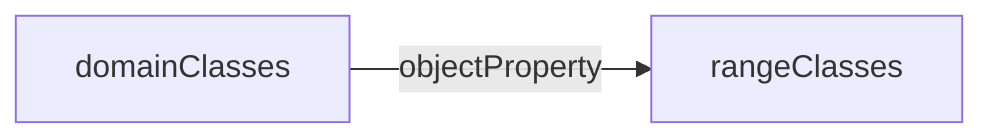

---
tags:
  - notetaking
  - data
  - business
  - learning
aliases:
---
Turns out Stanford's `Protégé` is free [[Open Source]] software. It's used to create [[Ontology]](s), and can be saved using multiple different [[Ontology Language]].

It includes plugins, like OWLViz, for visualizing your Ontology. 

### Classes
Classes can be **equivalent**. Equivalence is basically just an aliasing mechanism .`person` and `human`are equivalent.
Classes can be **Disjoint**. Disjoint means membership in one class means you cannot belong to any disjointed class. `cat` and `dog` are both subclasses of `animal` but they are disjoint. Catdog notwithstanding.

Classes have slots, which have a cardinality, value type, domain and range 

### Object Properties
Object Properties are how you create relationships between Classes, it looks like.
**Domain** (the non-pointy end of an arrow)
**Range** (the pointy end of the arrow)

You'd use an Object Property to say
`Movie` has Director `Director`
### Data Properties
Used to link classes to literals
This would be where you associate properties with classes. 
`Movie` has data properties:
	`releaseYear`: number

****
### Source
- Playing with it for a bit
- https://protegewiki.stanford.edu/wiki/Ontology101
- [Their Ontology Development 101 PDF](https://protege.stanford.edu/publications/ontology_development/ontology101.pdf)
- https://youtu.be/LQ4iW3PO36E?si=ZDY9BG6inzuI-dJI
### Related
- [[Basic Formal Ontology 2 0 Spec]]
- [[Ontology, Semantics, and Syntax]]
- [[Ontology Components]]