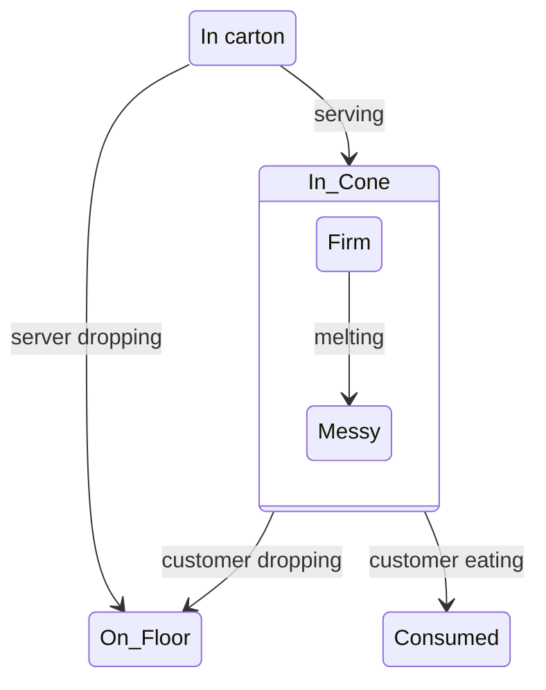

---
tags:
- modeling
---
**Graphical depiction of the ways an entity can exist and the transitions between them.**

State Diagrams give an abstract depiction of the different modes in which an entity or object can exist, and what the allowed transitions are (optionally annotated with mechanisms and/or names for those transitions). There are State Diagrams in [[UML]], [[SysML]], and the sole diagram type in [[OPM]] is arguably best described as a hybrid State Diagram/Block Definition Diagram.

Intensive dives into state diagrams gets you into the realm of graph theory in mathematics, like Petri Nets.

## Example

Using [[Mermaid]] to depict Ice Cream.

---

## Source
- [[SysML Distilled]]
- [[MIT 16 842 Fundamentals of Systems Engineering MIT Course]]
- [[Wikipedia]]

## Source

[mermaid - Markdownish syntax for generating flowcharts, sequence diagrams, class diagrams, gantt charts and git graphs.](https://mermaid-js.github.io/mermaid/#/stateDiagram)

[UML state machine - Wikipedia](https://en.wikipedia.org/wiki/UML_state_machine#Basic_UML_state_diagrams)

### Related Notes
- [[UML]] 
- [[SysML]] 
- [[IDEF3]]
- [[OPM]]
- [[Mermaid]]
- [[Graph Database]]