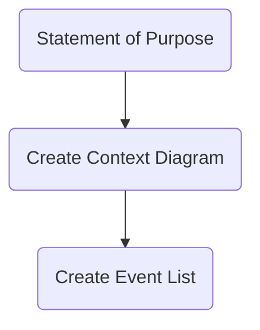

While every system's modeling project will come with unique constraints, there are some good general "first steps" to follow in most cases. These bring clarity to the modeling process and help drive the rest of the modeling. The first two steps also seem to align with the [[IDEF0]] spec, which I suppose isn't surprising given its shared history with [[Data Flow Diagram|DFD Diagrams]].

## 1. Define a System's Statement of Purpose
To be written for an audience unfamiliar with the system who won't be deeply involved in creating it. What is the system supposed to do? Why does it need to exist?

Example:

> The purpose of the Ajax Book Processing System is to handle all of the details of customer orders for books, as well as shipping, invoicing, and back-billing of customers with overdue invoices. Information about book orders should be available for other systems, such as marketing, sales, and accounting.

## 2. Create a Context Diagram
To help delineate the boundaries of the system, and to establish its main inputs & outputs.

Example:	
	![[screenshot 2.png]]

## 3. Create an Event List
Create a list of stimuli from the environment that the system must respond to. The source suggests labeling each as either a *flow-oriented event* (f), a *temporal event* (t), or a *control event* (c). Two of those seem like good ideas to me.

Example:

> 1.  Customer places order. (F)
> 2.  Customer cancels order. (F)
> 3.  Management requires sales report. (T)
> 4.  Book reprint order arrives at warehouse. (C)

> [!tip]+ Event-to-Context-Diagram-Arrow Relationship
> Every flow event should have an arrow on the context diagram, but not every arrow need necessarily be a flow event - as some may be related to *system-driven behaviors in response to events*. Example from above 

Flow events map to data flows on the Context Diagram. *(e.g. new invoice)*
Temporal events are associated with time *(e.g. weekly review)*
Control events, which seem like an arbitrary distinction from my perspective

## 4. Do the Rest
Go on from there to decompose the Context Diagram, model out the responses to the event list. There's several directions to go, depending on the language (or potentially [[Enterprise Architecture Frameworks]]) selected.

****
### Source
- [[Just Enough Structured Analysis]]

### Related
- [[SysML]]
