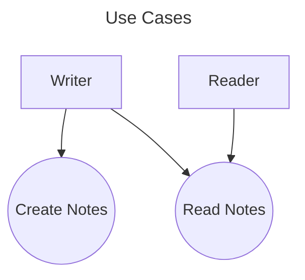

**Showing why a system exists and who cares about which parts.**

Use Case diagrams illustrate the services a system provides and the actors which care about those services. A system, when viewed through the lens of a Use Case diagram, can be thought of as a tool which provides utility/value to *someone*. The Use Case diagram makes that value clear.

---

- [[SysML Distilled]]

Uses Cases are a behavior of a system. Primary Actors are the people that invoke a Use Case. Secondary actors are anyone who is involved in the behavior.

## Example

### Related
- [[SysML]]